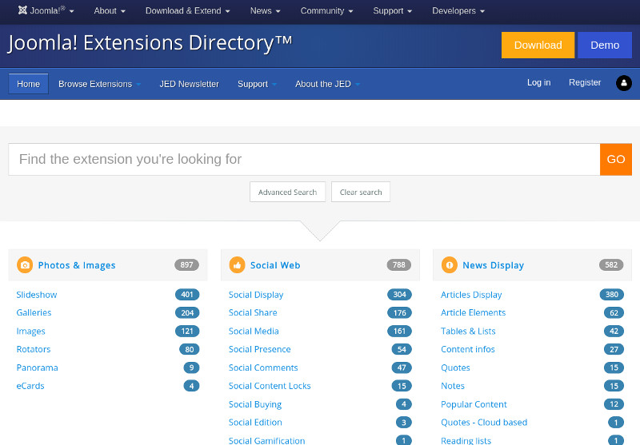
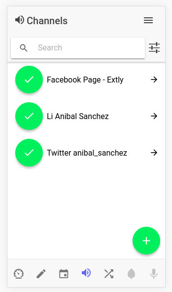

# About me

## Anibal Sanchez <!-- .slide: class="extly-slide-style" data-background="#ffa619" data-background-repeat="no-repeat" data-background-image="images/05-who/anibal-aikido_metropoli-alone.jpg" data-background-size="auto auto" data-background-position="100% 5%" -->

- Team leader of Extly Tech
  - Extensions Dev
  - Web Solutions: sites and apps
- Rapid web development (DevOps)
- +15 years in the Internet industry
- Runner and Aikidoka

<!-- .element: class="small" --> [@anibal_sanchez](https://twitter.com/anibal_sanchez) - anibal.sanchez[@]extly.com

## A Joomler <!-- .slide: data-background-image="images/05-who/joomla_logo.png" data-background-size="auto auto" data-background-position="100% 5%" -->

<blockquote cite="https://www.joomla.org/">
  &ldquo;Joomla! is an award-winning content management system (CMS), which enables you to build web sites and powerful online applications. - [www.joomla.org](https://www.joomla.org)&rdquo;
</blockquote>

- <!-- .element: class="small" --> Leadership Team member
- <!-- .element: class="small" --> Assistant Team Manager, Extensions Directory (JED)

## The Extension Directory (JED) <!-- .slide: data-background-image="images/05-who/joomla_logo.png" data-background-size="auto auto" data-background-position="100% 5%" -->

 <!-- .element: style="width: 50%" class="img-with-border" -->

<!-- .element: class="small" --> <https://extensions.joomla.org>

## Web Solutions <!-- .slide: data-background-image="images/05-who/extly-isologo.png" data-background-size="auto auto" data-background-position="95% 5%" -->

 <!-- .element: style="width: 25%" class="img-with-border" -->

<!-- .element: class="small" --> [AutoTweet](https://www.extly.com/autotweet-ng-pro.html) and [Joocial](https://www.extly.com/joocial.html) 9

<!-- .element: class="small" --> The App view on iPhone 5

Note: Two years ago ...

## Web Solutions <!-- .slide: data-background-image="images/05-who/extly-isologo.png" data-background-size="auto auto" data-background-position="95% 5%" -->

 <!-- .element: style="width: 25%" class="img-with-border" -->

<!-- .element: class="small" --> [AutoTweet](https://www.extly.com/autotweet-ng-pro.html) and [Joocial](https://www.extly.com/joocial.html) 9

<!-- .element: class="small" --> The App view on Galaxy 5

## Web Solutions <!-- .slide: data-background-image="images/05-who/extly-isologo.png" data-background-size="auto auto" data-background-position="95% 5%" -->

 <!-- .element: style="width: 50%" class="img-with-border" -->

<!-- .element: class="small" --> [AutoTweet](https://www.extly.com/autotweet-ng-pro.html) and [Joocial](https://www.extly.com/joocial.html) 9

<!-- .element: class="small" --> The App view on Desktop

## Web Solutions <!-- .slide: data-background-image="images/05-who/extly-isologo.png" data-background-size="auto auto" data-background-position="95% 5%" -->

Everything you need for a social network app

 <!-- .element: style="width: 20%" -->

<!-- .element: class="small" --> [JoomGap SlimApps](https://www.joomgap.com/slim-app.html)

## Web Solutions <!-- .slide: data-background-image="images/05-who/extly-isologo.png" data-background-size="auto auto" data-background-position="95% 5%" -->

 <!-- .element: style="width: 80%" -->

<!-- .element: class="small" --> [sisanjuan.gob.ar](https://sisanjuan.gob.ar) - By [Imagen y Sistemas](http://imagenysistemas.com.ar/)
