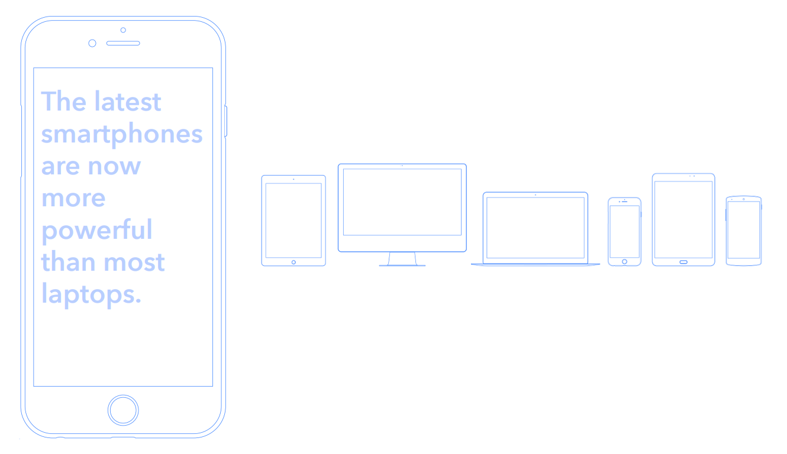

## Motivation <!-- .slide: data-background-repeat="no-repeat" data-background-image="images/00-home/jab18_logo.png" data-background-size="auto auto" data-background-position="100% 5%" -->

What is a modern extension?

- <!-- .element: class="fragment" --> A software for the next 10 years

- <!-- .element: class="fragment" --> To create a future,   without breaking with the past

## Motivation

It’s Not 2007 Anymore

<!-- .element: style="width: 60%" -->

<!-- .element: class="footnote" -->  Works cited: [Ionic’s eBook Hybrid vs. Native apps](https://gallery.mailchimp.com/5f519fa4079bd8ee76c7f48b3/files/e1fbd9ae-3ecf-4221-8d14-8901a7c52cb2/Ionic_eBook_v9.01.pdf)

Note:
A modern extension supports the new clients.

# Publish or perish

## Motivation

New clients =  Market Growth

<!-- .element: style="width: 60%" -->

## Motivation

Grow fast or die slow

<!-- .element: style="width: 60%" -->

<!-- .element: class="footnote" --> Works cited: [McKinsey & Company: Grow fast or die slow](https://www.mckinsey.com/industries/high-tech/our-insights/grow-fast-or-die-slow)

## One Opportunity

There is no modern CMS for this era ... yet.

## One Opportunity

<!-- .element: class="fragment" --> <i class="far fa-check-square"></i> Provide innovative services.

<!-- .element: class="fragment" --> <i class="far fa-check-square"></i> Support your clients.

<!-- .element: class="fragment" --> <i class="far fa-check-square"></i> Solve challenges.

<!-- .element: class="fragment" --> <i class="far fa-check-square"></i> Reach new markets.

<!-- .element: class="fragment" --> <i class="far fa-check-square"></i> Introduce new business models.

<!-- .element: class="fragment" --> <i class="far fa-check-square"></i> Find your strength.

<!-- .element: class="fragment" --> <i class="far fa-check-square"></i> Learn something new every day.
