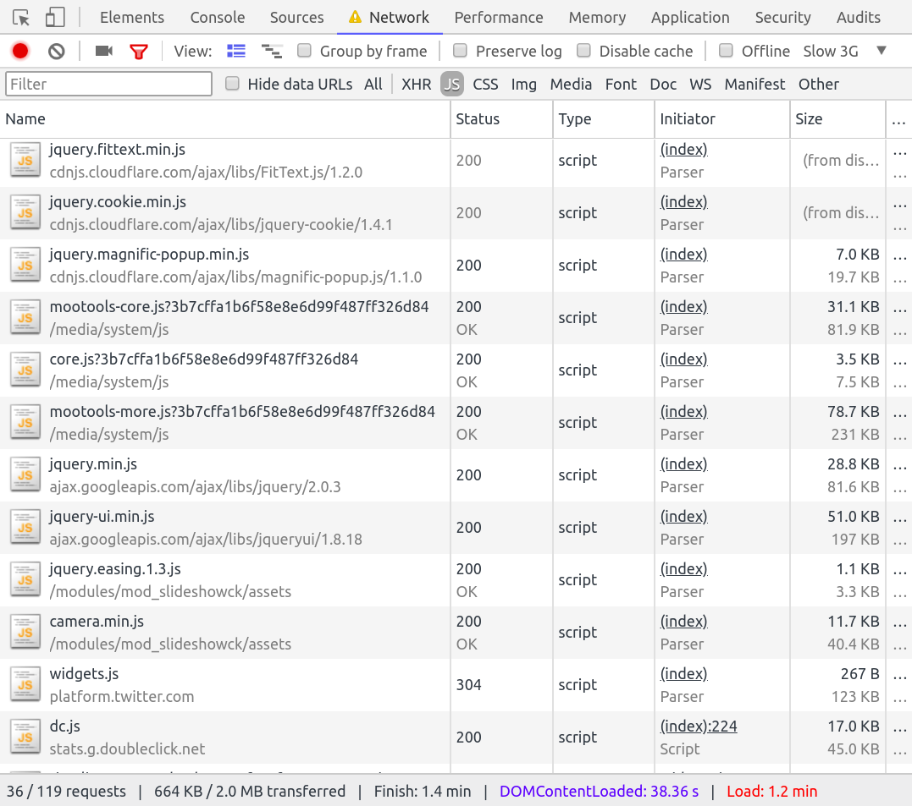

## Where we are <!-- .slide: data-background-image="images/05-who/joomla_logo.png" data-background-size="auto auto" data-background-position="100% 5%" -->

<!-- .element: class="fragment" --> 

<!-- .element: class="fragment small" --> _**GAP Analisys**: In management literature, gap analysis involves the comparison of actual performance with potential or desired performance_

## The good parts <!-- .slide: data-background-image="images/05-who/joomla_logo.png" data-background-size="auto auto" data-background-position="100% 5%" -->

- <!-- .element: class="fragment" --> Joomla is a full multilingual CMS
- <!-- .element: class="fragment" --> An object-oriented foundation
  - MVC pattern
  - "Component - Module - Plugin" triad
- <!-- .element: class="fragment" --> A solid core to develop any system
- <!-- .element: class="fragment" --> A huge ecosystem of extensions
- <!-- .element: class="fragment" --> Rich, loyal, and diverse community

## desktop-only <!-- .slide: data-background-image="images/05-who/joomla_logo.png" data-background-size="auto auto" data-background-position="100% 5%" -->

<!-- .element: class="fragment" --> _Joomla is not a Headless CMS_

<!-- .element: class="fragment" --> Joomla has tight integration with Web views

<!-- .element: class="fragment" --> No Web Services / RESTful API

<!-- .element: class="fragment" --> No Command Line Interface (CLI)

Note:
Build your own CLI or RESTful API.
You can write your own CLI and RESTful API... but
... and it is not going to be.

## desktop-only <!-- .slide: data-background-image="images/05-who/joomla_logo.png" data-background-size="auto auto" data-background-position="100% 5%" -->

_Mobile support based on responsive design 1.0._

- Bootstrap 2.3 - jQuery 1.12
- Chosen 1.6, Mootools 1.6, etc.

<!-- .element: class="fragment small" --> Joomla 3.9 Sept/2018 - Joomla 3.10 Mar/2019 - EOL Mar 2021

Note:
TIP: Avoid them as much as possible.

## desktop-only <!-- .slide: data-background-image="images/05-who/joomla_logo.png" data-background-size="auto auto" data-background-position="100% 5%" -->

 <!-- .element: style="width: 60%" -->

## desktop-only <!-- .slide: data-background-image="images/05-who/joomla_logo.png" data-background-size="auto auto" data-background-position="100% 5%" -->

_Component, Modules and Plugins_

- <!-- .element: class="fragment small" --> Any extension can add CSS and Scripts
- <!-- .element: class="fragment small" --> Hugh number of HTTP requests
- <!-- .element: class="fragment small" --> High loading time in Slow 3G and 4G

## desktop-only <!-- .slide: data-background-image="images/05-who/joomla_logo.png" data-background-size="auto auto" data-background-position="100% 5%" -->

_Legacy MVC implementation_

 

- <!-- .element: class="small" --> `JControllerForm`, `JControllerAdmin`, `JControllerLegacy`,  `JModelLegacy`, `JViewLegacy` ...
- <!-- .element: class="small" --> HTTP v1 GET - POST protocol (pre-Ajax)
- <!-- .element: class="small" --> Some Ajax support (com_ajax)

Note:
This is a problem of all the current generation of CMSs

## desktop-only <!-- .slide: data-background-image="images/20-where/configurationitis.jpg" data-background-size="auto auto" data-background-position="100% 5%" -->

_Configurationitis - Pluginitis_

 

<!-- .element: class="fragment" --> "Just add one more setting"

<!-- .element: class="fragment" --> "Just add one more plugin"

# GAP Analisys <!-- .slide: data-background-image="images/05-who/joomla_logo.png" data-background-size="auto auto" data-background-position="100% 5%" -->

Where we want to be

## New clients <!-- .slide: data-background-image="images/05-who/joomla_logo.png" data-background-size="auto auto" data-background-position="100% 5%" -->

- Mobile Apps
- Desktop Apps
- New Screens

 

<!-- .element: class="fragment small" --> A JavaScript (ES6) World

<!-- .element: class="fragment small" --> React (Facebook) - TypeScript (MS) - Angular (Google) - Vue.js - Electron

## Backwards compatibility <!-- .slide: data-background-image="images/05-who/joomla_logo.png" data-background-size="auto auto" data-background-position="100% 5%" -->

- <!-- .element: class="fragment small" --> Reuse the current stack as much as possible
- <!-- .element: class="fragment small" --> Protect the current investment
- <!-- .element: class="fragment small" --> Extend the life of the current technology

## GAP Analisys <!-- .slide: data-background-image="images/05-who/joomla_logo.png" data-background-size="auto auto" data-background-position="100% 5%" -->

Where we are going to be

## Around the corner <!-- .slide: data-background-image="images/05-who/joomla_logo.png" data-background-size="auto auto" data-background-position="100% 5%" -->

> By 2020 PWAs will replace 50%   of consumer-facing apps

<!-- .element: class="footnote" --> Works cited: [Gartner - Progressive Web Apps Will Impact Your Mobile App Strategy](https://www.gartner.com/doc/3645344/progressive-web-apps-impact-mobile)

## Progressive Web Apps <!-- .slide: data-background-image="images/05-who/joomla_logo.png" data-background-size="auto auto" data-background-position="100% 5%" -->

The change of Web Paradigm

Web Site | App
-------------|---------
Request - Page| API Calls
              | SW Management

## PWA - SW <!-- .slide: data-background-image="images/05-who/joomla_logo.png" data-background-size="auto auto" data-background-position="100% 5%" -->

Service Workers are already implemented in [all](https://caniuse.com/#feat=serviceworkers) modern browsers.

- <!-- .element: class="small" -->  Advanced Cache
- <!-- .element: class="small" -->  Home Screen Management
- <!-- .element: class="small" -->  Lazy (Background) Loading
- <!-- .element: class="small" -->  Offline Navigation
- <!-- .element: class="small" -->  Splash screen
- <!-- .element: class="small" -->  Theming
- <!-- .element: class="small" -->  Web Push Notifications

<!-- .element: class="footnote" -->  TO-DO: Build a Service Worker with [XT Workbox for Joomla](https://www.extly.com/xt-workbox-for-joomla).
