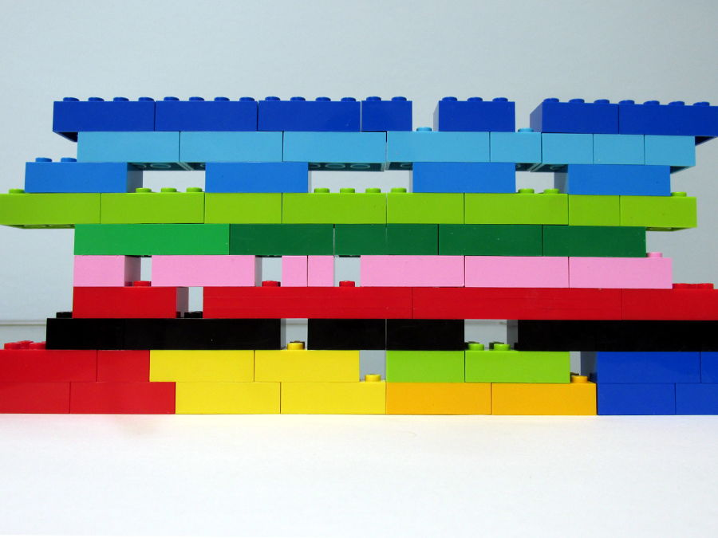
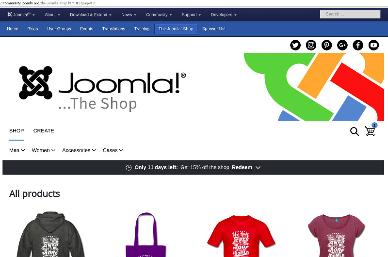
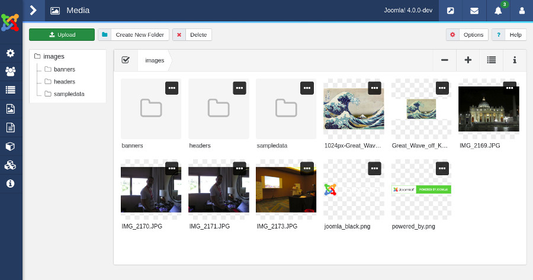
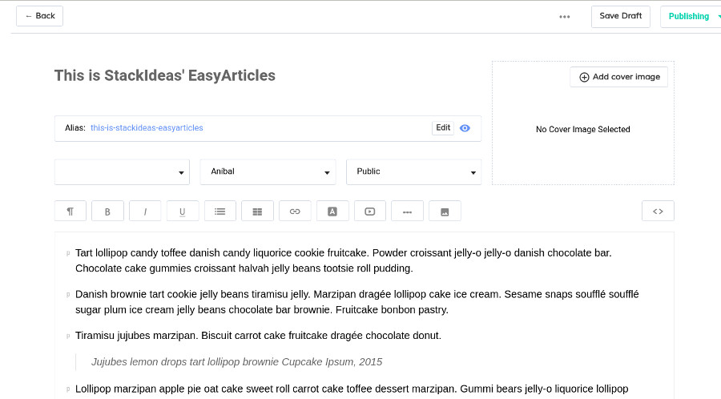
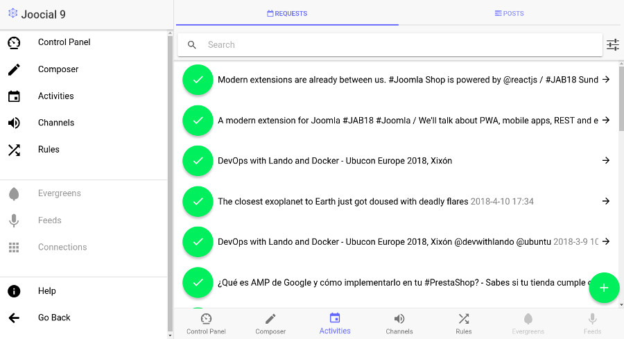
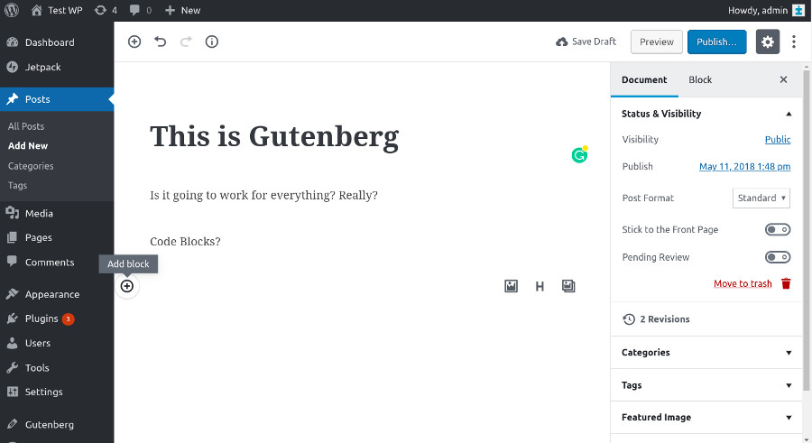
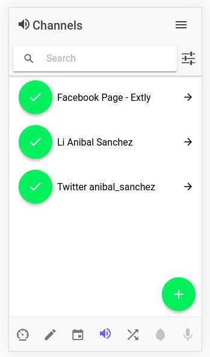

## A recipe for modernity

## The Application Mode

## The App Mode

<!-- .element: class="small fragment" -->  <!-- .element: style="width: 70%" -->

## The Application Mode

<!-- .element: style="width: 40%" -->

Joomla - Web App

## The Application Mode

A single app per page (SPA)

<!-- .element: class="small fragment" --> `index.php ? option=com_content & view=articles & tmpl=component`

<!-- .element: class="small fragment" --> `index.php ? option=app_content # articles` ;-)

## Benefits of the App Mode

- <!-- .element: class="fragment" --> A full screen view
- <!-- .element: class="fragment" --> Under control of the App
- <!-- .element: class="fragment" --> No more spagetthi of mixed scripts
- <!-- .element: class="fragment" --> No more modules or plugins
- <!-- .element: class="fragment" --> My code or die(1);

## Apps around us

**Joomla Shop**

<!-- .element: style="width: 50%" class="img-with-border" -->

- <!-- .element: class="small" --> Joomla Shop is powered by [React](https://reactjs.org/).
- <!-- .element: class="small" --> Online service provided by [spreadshirt.ie](https://spreadshirt.ie)
- <!-- .element: class="small" --> CMS agnostic, it works everywhere. Online service. Monthly Subscription.

## Apps around us

**J4 Media Manager**

<!-- .element: style="width: 50%" class="img-with-border" -->

- <!-- .element: class="small" --> Joomla Media Manager is powered by [Vue.js](https://vuejs.org/).
- <!-- .element: class="small" --> Custom API (com_media)
- <!-- .element: class="small" --> Integrated with Joomla Backend Template

## Apps around us

**Easy Articles**

<!-- .element: style="width: 50%" class="img-with-border" -->

- <!-- .element: class="small" --> Full screen view
- <!-- .element: class="small" --> Pure Joomla extension
- <!-- .element: class="small" --> Custom API (com_easyarticles)

<!-- .element: class="footnote" --> [stackideas.com/easyarticles](https://stackideas.com/easyarticles)

## Apps around us

**Joocial 9**

<!-- .element: style="width: 50%" class="img-with-border" -->

- <!-- .element: class="small" --> Full screen view
- <!-- .element: class="small" --> **Joocial 9 Beta** is powered by [Ionic](https://ionicframework.com) (TypeScript/ Angular).
- <!-- .element: class="small" --> Custom API (com_joocial)
- <!-- .element: class="small" --> Backend powered by Silex and Laravel Eloquent

<!-- .element: class="footnote" --> [Extly's Joocial](https://www.extly.com/joocial.html)

## Apps around us

**WordPress Gutenberg**

<!-- .element: style="width: 50%" class="img-with-border" -->

- <!-- .element: class="small" --> A full Web App as a 100% plugin
- <!-- .element: class="small" --> Gutenberg is powered by [React](https://reactjs.org/)
- <!-- .element: class="small" --> Based on WP REST API
- <!-- .element: class="small" --> The page builder will have **Blocks** (React-WP API)

## Web App - UI <!-- .slide: data-background-repeat="no-repeat" data-background-image="images/30-how/com.tplink.tether.jpg" data-background-size="auto auto" data-background-position="95% 5%" style="text-align: left" -->

<!-- .element: class="small" --> Define the User Interface in terms of  specific use cases.

- Who
- What / Why
- Where
- When
- How

Note:
One case at a time

## Web App - UI <!-- .slide: data-background-repeat="no-repeat" data-background-image="images/30-how/com.tplink.tether.jpg" data-background-size="auto auto" data-background-position="95% 5%" style="text-align: left" -->

 <!-- .element: style="width: 25%" class="img-with-border" -->

<!-- .element: class="footnote" --> [Extly's Joocial](https://www.extly.com/joocial.html)

## Web App - Comm

<!-- .element: class="small" --> Beyond content pages, our Apps must communicate sensibily.

- Reduce the number of requests
- Semantic protocol
- Business Microservices

## Web Services 911

Implement any kind of **Web Service**

- <!-- .element: class="small" --> Akeeba's [FOF](https://github.com/akeeba/fof) Framework on Framework
- <!-- .element: class="small" --> TechJoomla's [com_api](https://github.com/techjoomla/com_api) - API framework for Joomla
- <!-- .element: class="small" --> Laravel Lumen
- <!-- .element: class="small" --> Slim Framework
- <!-- .element: class="small" --> Symfony 4

## The Domain

Build your own Business Domain

**Services and Models**

- <!-- .element: class="small" --> Joomla Models
- <!-- .element: class="small" --> FOF Models
- <!-- .element: class="small" --> Laravel Eloquent

## CMS Agnostic Layer

Define a "The World as I See It"

- <!-- .element: class="small" --> Be ready for Joomla 3 / 4 ... X
- <!-- .element: class="small" --> Build Interfaces to the World

<!-- .element: class="footnote" --> TO-DO: Learn from other CMSs: Bolt, Grav, October, PrestaShop and WordPress

## A modern toolbox

[Composer](https://getcomposer.org/), [node.js](https://nodejs.org/en/) and [npm](https://www.npmjs.com/) are your friends.

<!-- .element: style="width: 40%" -->

## A modern toolbox <!-- .slide: data-background-image="images/05-who/extly-isologo.png" data-background-size="auto auto" data-background-position="95% 5%" -->

[Devops with Lando and Docker](https://extly.tech/media/devops-with-lando-and-docker/index.html#/)

[Webpack build files for Joomla Extensions](https://github.com/anibalsanchez/extly-boilerplate-buildfiles-for-joomla)
